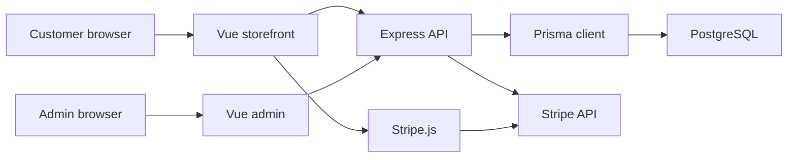

# Doggy Ent Architecture

Last updated: 2026-06-06

This directory documents how the Doggy Ent Vue storefront, admin dashboard, Express API, Prisma database, Stripe integration, and temporary local admin workflows fit together. It is evidence-based from the repository; future plans are labeled as future work.

## Project Shape

Doggy Ent is a Vue 3 + Vite storefront and admin app backed by an Express 5 API, Prisma, PostgreSQL, and Stripe. Customers browse products, choose product variants, add items to cart, validate promos, pay through Stripe, and receive an order success page. Admin users manage products, promos, campaigns, and orders through protected admin pages.

## Docs

- [data-flow.md](./data-flow.md): End-to-end flows for storefront, cart, checkout, Stripe, promos, campaigns, orders, admin CRUD, and local/Railway DB modes.
- [file-map.md](./file-map.md): Important files and folders, grouped by responsibility.
- [database.md](./database.md): Prisma models, relationships, migrations, ownership, and data-source rules.
- [admin.md](./admin.md): Admin dashboard architecture, auth, protected APIs, and temporary data target workflow.
- [auth-roadmap.md](./auth-roadmap.md): Current custom admin auth, same-site domain direction, and future Better Auth/customer accounts plan.

## Important Source-Of-Truth Locations

- Product variants and storefront selected card size state: `client/src/domains/products/composables/useProductVariants.js`
- Cart item creation and local cart state: `client/src/domains/cart/composables/useCart.js`
- Product API mapping: `server/src/domains/products/mappers/products.mapper.js`
- Checkout pricing: `server/src/domains/checkout/utils/checkoutPricing.js`
- Checkout orchestration: `server/src/domains/checkout/services/checkout.service.js`
- Promo statuses and rules: `server/src/domains/promos/constants/promos.constants.js`, `client/src/domains/promos/constants/promo.constants.js`
- Promo server normalization and validation: `server/src/domains/promos/services/promos.service.js`, `server/src/domains/promos/validators/promos.validator.js`
- Campaign statuses and donation rules: `server/src/domains/campaigns/constants/campaigns.constants.js`, `server/src/domains/campaigns/services/campaigns.service.js`
- Order statuses and timeline labels: `client/src/domains/admin/constants/adminOrders.constants.js`, `server/src/domains/orders/constants/orders.constants.js`
- Admin auth/session: `server/src/domains/auth/services/auth.service.js`, `server/src/domains/auth/routes/auth.routes.js`
- API base URL and JSON error handling: `client/src/shared/api/http.js`
- Environment loading and local/Railway DB admin mode: `server/src/config/env.js`

## Modes

| Mode | Command Shape | Browser API Target | Server DB Target | Purpose |
| --- | --- | --- | --- | --- |
| Fully local | `cd server && npm run dev:local`; `cd client && npm run dev:local` | Local server | Local DB from `server/.env` | Safe local development |
| Railway DB admin | `cd server && npm run dev:railway`; `cd client && npm run dev:local` | Local server | Railway DB from `server/.env.railway.local` override | Manage deployed storefront data without browser cross-site admin cookies |
| Vercel storefront | Vercel build/deploy | Deployed API origin from `VITE_API_BASE_URL` or `VITE_API_URL` | Railway DB | Production storefront/checkout |

No real environment values should be committed or documented. See [admin.md](./admin.md) and [auth-roadmap.md](./auth-roadmap.md) for variable names only.
