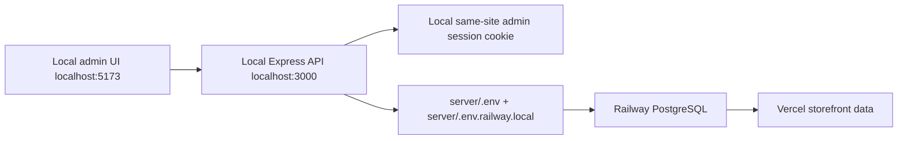

# Admin Architecture

Last updated: 2026-06-07

## Overview

The admin dashboard is a Vue route group protected by a router guard and protected server API routes. It manages products, promos, campaigns, and orders. The current auth system is custom admin auth; Better Auth is future work.

## Admin Routes

Client routes live in `client/src/app/router/index.js`.

| Route | View | Notes |
| --- | --- | --- |
| `/admin/login` | `AdminLoginView.vue` | Public login page. |
| `/admin` | `AdminDashboardView.vue` | Protected dashboard. |
| `/admin/products` | `AdminProductsView.vue` | Protected product CRUD. |
| `/admin/promos` | `AdminPromosView.vue` | Protected promo CRUD/test/analytics. |
| `/admin/campaigns` | `AdminCampaignsView.vue` | Protected campaign CRUD. |
| `/admin/orders` | `AdminOrdersView.vue` | Protected order list. |
| `/admin/orders/:orderId` | `AdminOrderDetailView.vue` | Protected order detail/status. |

The router guard calls `/api/auth/me` through `fetchApi`. Server admin API routes must also use `requireAdminAuth`; the client guard is not a security boundary.

## Auth Flow

1. Login page posts admin credentials to `/api/auth/login`.
2. Server validates `ADMIN_EMAIL` and `ADMIN_PASSWORD_HASH`.
3. Server creates a custom admin session cookie.
4. Client route guard calls `/api/auth/me`.
5. Server validates the cookie/session and returns `authenticated: true`.
6. Protected admin routes render.

The current session layer is temporary and documented in [auth-roadmap.md](./auth-roadmap.md).

## Admin Data Target Badge

`client/src/domains/admin/components/AdminDataTargetBadge.vue` calls `/api/auth/data-target` after auth and displays the backend's configured data target:

- `LOCAL DATA TARGET`
- `RAILWAY DB TARGET`

The server target is derived from `DOGGY_SERVER_ENV_TARGET` in `server/src/config/env.js`.

## Temporary Railway DB Admin Workflow

Commands:

- Fully local: `cd server && npm run dev:local`; `cd client && npm run dev:local`
- Railway DB admin: `cd server && npm run dev:railway`; `cd client && npm run dev:local`

Railway DB admin mode intentionally keeps browser admin requests pointed at the local backend. The local backend writes to Railway PostgreSQL.

## Required Env Variable Names

Values must live in local `.env` files or deployment dashboards and must not be committed.

Server/Railway names:

- `PORT`
- `NODE_ENV`
- `CLIENT_URL`
- `FRONTEND_URL`
- `ADMIN_EMAIL`
- `ADMIN_PASSWORD_HASH`
- `ADMIN_SESSION_SECRET`
- `STRIPE_SECRET_KEY`
- `DATABASE_URL`

Client/Vercel names:

- `VITE_API_BASE_URL`
- `VITE_API_URL` as backward-compatible API origin alias
- `VITE_STRIPE_PUBLISHABLE_KEY`
- `VITE_ADMIN_DATA_TARGET` for local admin badge mode

Local-only Railway DB admin override file:

- `server/.env.railway.local`

Required variable names in that file:

- `DATABASE_URL`
- `FRONTEND_URL`
- `ADMIN_EMAIL`
- `ADMIN_PASSWORD_HASH`
- `STRIPE_SECRET_KEY` if payment/admin flows need Stripe access
- `ADMIN_SESSION_SECRET` recommended

## Admin Domains

### Products

Client product admin code is split into view, composable, API wrapper, constants, mappers, validators, and components. Server product code follows route/controller/service/mapper/validator patterns.

Primary files:

- `client/src/domains/admin/views/AdminProductsView.vue`
- `client/src/domains/admin/composables/useAdminProducts.js`
- `client/src/domains/admin/api/adminProducts.api.js`
- `client/src/domains/admin/components/AdminProductFormPanel.vue`
- `server/src/domains/products/*`

### Promos

Admin promos use shared promo constants/rules on the client and server-side normalization/validation before Prisma writes.

Primary files:

- `client/src/domains/admin/views/AdminPromosView.vue`
- `client/src/domains/admin/composables/useAdminPromos.js`
- `client/src/domains/admin/mappers/adminPromoForm.mapper.js`
- `server/src/domains/promos/routes/promos.routes.js`
- `server/src/domains/promos/services/promos.service.js`
- `server/src/domains/promos/repositories/promos.repository.js`

### Campaigns

Admin campaigns manage donation campaigns and product links.

Primary files:

- `client/src/domains/admin/views/AdminCampaignsView.vue`
- `client/src/domains/admin/composables/useAdminCampaigns.js`
- `client/src/domains/admin/mappers/adminCampaignForm.mapper.js`
- `server/src/domains/campaigns/*`

Campaign admin responses include recent attributed orders when `OrderCampaignUsage` rows exist. Historical aggregate donation totals may not have order-level attribution if those orders were created before the attribution migration.

### Orders

Admin orders read checkout-created records, stage order status changes, and show donation/campaign attribution when persisted.

Primary files:

- `client/src/domains/admin/views/AdminOrdersView.vue`
- `client/src/domains/admin/views/AdminOrderDetailView.vue`
- `client/src/domains/admin/components/AdminOrderStatusPanel.vue`
- `client/src/domains/admin/composables/useAdminOrders.js`
- `client/src/domains/admin/api/adminOrders.api.js`
- `server/src/domains/orders/*`

Status update behavior:

- Current status is displayed as read-only context.
- The admin selects the next status separately.
- Save persists the status change; Cancel discards the staged selection.
- Status changes create `OrderStatusHistory` rows.
- Until Better Auth/admin users exist, history rows use `changedByType: ADMIN_ENV` and `changedBy: ADMIN_ENV`.

Admin order detail shows:

- Friendly customer reference.
- Internal order id for admin.
- Customer and shipping data.
- Item/variant/quantity/price rows.
- Subtotal, discount, shipping, tax, donation, and total.
- Promo usage when recorded.
- Campaign attribution when `OrderCampaignUsage` rows exist.
- Stripe PaymentIntent id for admin only.
- Other recent orders from the same customer email.
- Last order update timestamp.
- Last status change.
- Full status history.

## Manual QA Checklist

- Log into local admin in fully local mode and confirm badge says local target.
- Create/edit/delete a local test product and confirm local DB only.
- Start Railway DB admin mode and confirm badge says Railway DB target.
- Create/edit a promo with start/end dates and confirm no DateTime Prisma error.
- Open admin products, promos, campaigns, orders, and order detail.
- On order detail, change status, click Cancel, and confirm no persistence.
- On order detail, change status, click Save, and confirm status history gets a new row.
- Confirm browser admin CRUD calls hit the local backend in temporary Railway DB admin mode.
- Confirm Vercel storefront sees Railway DB data after the local backend writes to Railway DB.
