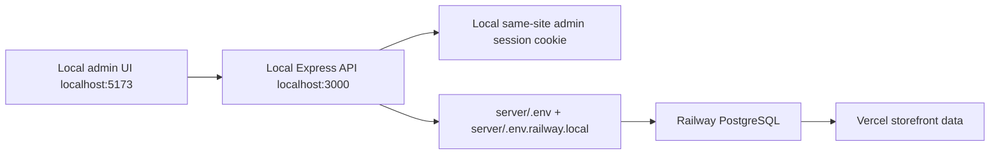

# Admin Architecture

Last updated: 2026-10-09

## Overview

The admin dashboard is a Vue route group protected by a router guard and protected server API routes. It manages products, promos, campaigns, orders, and customer accounts. The current admin auth system remains custom admin auth; Better Auth currently powers customer accounts and is prepared to replace admin auth in a later permissions phase.

## Admin Routes

Client routes live in `client/src/app/router/index.js`.

| Route | View | Notes |
| --- | --- | --- |
| `/admin/login` | `AdminLoginView.vue` | Public login page. |
| `/admin` | `AdminDashboardView.vue` | Protected dashboard. |
| `/admin/products` | `AdminProductsView.vue` | Protected product CRUD. |
| `/admin/promos` | `AdminPromosView.vue` | Protected promo CRUD/test/analytics. |
| `/admin/campaigns` | `AdminCampaignsView.vue` | Protected campaign CRUD. |
| `/admin/orders` | `AdminOrdersView.vue` | Protected order list. |
| `/admin/orders/:orderId` | `AdminOrderDetailView.vue` | Protected order detail/status. |
| `/admin/customers` | `AdminCustomersView.vue` | Protected customer list. |
| `/admin/customers/:customerId` | `AdminCustomerDetailView.vue` | Protected customer detail, linked orders, readiness actions. |
| `/admin/shipments` | `AdminShipmentsView.vue` | Protected shipment history and carrier events. |
| `/admin/notifications` | `AdminNotificationsView.vue` | Protected delivery history; template center is future work. |
| `/admin/reports` | `AdminReportsView.vue` | Protected all-time operational summaries. |
| `/admin/order-issues` | `AdminOrderIssuesView.vue` | Protected support cases, notes/replies, and history. |
| `/admin/internal-issues` | `AdminInternalIssuesView.vue` | Protected sanitized operational issues and history. |

The router guard calls `/api/auth/me` through `fetchApi`. Server admin API routes must also use `requireAdminAuth`; the client guard is not a security boundary.

## Shared Calm Workspace

Protected admin route entries are nested under `AdminLayout.vue` while retaining their existing public paths and route names. Login stays outside that layout. The existing cookie guard remains unchanged.

`AdminLayout.vue` owns identity, logout, the existing backend-derived target badge, and `AdminSidebar.vue`. `adminNavigation.constants.js` is the single list of eleven tools and active-route matching. The nested RouterView is keyed by path, so changing order/customer IDs creates a fresh detail state rather than reusing a stale onMounted-only record.

Admin styling lives in `client/src/assets/styles/admin.css`, uses Tailwind utilities with a Tailwind reference directive, and is scoped to admin elements/tokens. `AdminIcon.vue` maps semantic names to `@lucide/vue` icons. Storefront/account styling and state are not replaced.

Views compose existing domain APIs/mappers/validators. `useAdminOverview` combines protected reads with partial-failure handling; `useAdminActivity` shares notification/shipment loading; `useAdminOrderDetail` owns record actions; `useAdminIssueWorkspace` shares selection/staged saves; `useAdminOrderIssues` adds reply state. `AdminScheduleFields` shares date/time controls without changing either payload mapper.

Products/promos/campaigns use explicit list/editor state. Analytics/impact panels do not persist changes. Future feature sections contain no mock business results or mutation endpoints.

## Auth Flow

1. Login page posts admin credentials to `/api/auth/login`.
2. Server validates `ADMIN_EMAIL` and `ADMIN_PASSWORD_HASH`.
3. Server creates a custom admin session cookie.
4. Client route guard calls `/api/auth/me`.
5. Server validates the cookie/session and returns `authenticated: true`.
6. Protected admin routes render.

The current session layer is temporary and documented in [auth-roadmap.md](./auth-roadmap.md).

## Admin Data Target Badge

`client/src/domains/admin/components/AdminDataTargetBadge.vue` calls `/api/auth/data-target` after auth and displays the backend's configured data target:

- `LOCAL DATA TARGET`
- `RAILWAY DB TARGET`

The server target is derived from `DOGGY_SERVER_ENV_TARGET` in `server/src/config/env.js`.

## Temporary Railway DB Admin Workflow

```mermaid
flowchart LR
  Browser["Local admin UI localhost:5173"] --> Backend["Local Express API localhost:3000"]
  Backend --> Session["Local same-site admin session cookie"]
  Backend --> Env["server/.env + server/.env.railway.local"]
  Env --> RailwayDB["Railway PostgreSQL"]
  RailwayDB --> Storefront["Vercel storefront data"]
```

Commands:

- Fully local: `cd server && npm run dev:local`; `cd client && npm run dev:local`
- Railway DB admin: `cd server && npm run dev:railway`; `cd client && npm run dev:local`

Railway DB admin mode intentionally keeps browser admin requests pointed at the local backend. The local backend writes to Railway PostgreSQL.

## Required Env Variable Names

Values must live in local `.env` files or deployment dashboards and must not be committed.

Server/Railway names:

- `PORT`
- `NODE_ENV`
- `CLIENT_URL`
- `FRONTEND_URL`
- `ADMIN_EMAIL`
- `ADMIN_PASSWORD_HASH`
- `ADMIN_SESSION_SECRET`
- `STRIPE_SECRET_KEY`
- `DATABASE_URL`

Client/Vercel names:

- `VITE_API_BASE_URL`
- `VITE_API_URL` as backward-compatible API origin alias
- `VITE_STRIPE_PUBLISHABLE_KEY`
- `VITE_ADMIN_DATA_TARGET` for local admin badge mode
- `VITE_STRIPE_DASHBOARD_PAYMENTS_URL` optional public Stripe payments dashboard base; not a Stripe API key

Local-only Railway DB admin override file:

- `server/.env.railway.local`

Required variable names in that file:

- `DATABASE_URL`
- `FRONTEND_URL`
- `ADMIN_EMAIL`
- `ADMIN_PASSWORD_HASH`
- `STRIPE_SECRET_KEY` if payment/admin flows need Stripe access
- `ADMIN_SESSION_SECRET` recommended

## Admin Domains

### Products

Client product admin code is split into view, composable, API wrapper, constants, mappers, validators, and components. Server product code follows route/controller/service/mapper/validator patterns.

Primary files:

- `client/src/domains/admin/views/AdminProductsView.vue`
- `client/src/domains/admin/composables/useAdminProducts.js`
- `client/src/domains/admin/api/adminProducts.api.js`
- `client/src/domains/admin/components/AdminProductFormPanel.vue`
- `server/src/domains/products/*`

### Promos

Admin promos use shared promo constants/rules on the client and server-side normalization/validation before Prisma writes.

Primary files:

- `client/src/domains/admin/views/AdminPromosView.vue`
- `client/src/domains/admin/composables/useAdminPromos.js`
- `client/src/domains/admin/mappers/adminPromoForm.mapper.js`
- `server/src/domains/promos/routes/promos.routes.js`
- `server/src/domains/promos/services/promos.service.js`
- `server/src/domains/promos/repositories/promos.repository.js`

### Campaigns

Admin campaigns manage donation campaigns and product links.

Primary files:

- `client/src/domains/admin/views/AdminCampaignsView.vue`
- `client/src/domains/admin/composables/useAdminCampaigns.js`
- `client/src/domains/admin/mappers/adminCampaignForm.mapper.js`
- `server/src/domains/campaigns/*`

Campaign admin responses include recent attributed orders when `OrderCampaignUsage` rows exist. Historical aggregate donation totals may not have order-level attribution if those orders were created before the attribution migration.

### Orders

Admin orders read checkout-created records, stage order status changes, and show donation/campaign attribution when persisted.

Primary files:

- `client/src/domains/admin/views/AdminOrdersView.vue`
- `client/src/domains/admin/views/AdminOrderDetailView.vue`
- `client/src/domains/admin/components/AdminOrderStatusPanel.vue`
- `client/src/domains/admin/composables/useAdminOrders.js`
- `client/src/domains/admin/api/adminOrders.api.js`
- `server/src/domains/orders/*`

Status update behavior:

- Current status is displayed as read-only context.
- The admin selects the next status separately.
- Save persists the status change; Cancel discards the staged selection.
- Status changes create `OrderStatusHistory` rows.
- Until Better Auth/admin users exist, history rows use `changedByType: ADMIN_ENV` and `changedBy: ADMIN_ENV`.

Admin order detail shows:

- Friendly customer reference.
- Internal order id for admin.
- Customer and shipping data.
- Item/variant/quantity/price rows.
- Subtotal, discount, shipping, tax, donation, and total.
- Promo usage when recorded.
- Campaign attribution when `OrderCampaignUsage` rows exist.
- Stripe PaymentIntent id for admin only.
- Other recent orders from the same customer email.
- Last order update timestamp.
- Last status change.
- Full status history.
- Shipment tracking controls for carrier, tracking number, status, tracking URL, and refresh.
- Shipment timeline/event history when Shippo or manual status updates are present.
- Order notification history from `EmailDelivery`.
- Resend controls for confirmation, tracking, delivered, and review request emails.

### Customers

Admin customers use the existing admin auth guard and read Better Auth customer tables through a separate server customers domain.

Primary files:

- `client/src/domains/admin/views/AdminCustomersView.vue`
- `client/src/domains/admin/views/AdminCustomerDetailView.vue`
- `client/src/domains/admin/api/adminCustomers.api.js`
- `client/src/domains/admin/composables/useAdminCustomers.js`
- `client/src/domains/admin/components/AdminCustomersTable.vue`
- `client/src/domains/admin/components/AdminCustomerOrdersPanel.vue`
- `server/src/domains/customers/routes/adminCustomers.routes.js`
- `server/src/domains/customers/services/adminCustomers.service.js`
- `server/src/domains/customers/repositories/adminCustomers.repository.js`

Implemented customer admin capabilities:

- Customer list with name, email, verification state, role, account status, created date, order count, lifetime spend, and latest order date.
- Customer detail with profile summary, linked orders, verified-email guest order matches, activity/events, support/review/loyalty/referral readiness copy, and notification preference visibility through the API.
- Deactivate/reactivate readiness by updating `User.status` and recording `CustomerAccountEvent`.
- Resend verification and password reset readiness through the email provider abstraction.
- Notification history from `EmailDelivery`.

### Notifications

Admin notification activity is visible in:

- `/admin`: compact dashboard metric cards.
- `/admin/notifications`: delivery history, resend history, failed/mocked/skipped status, provider state, and event/status filters.
- `/admin/orders/:orderId`: order-scoped email delivery history and resend controls.
- `/admin/customers/:customerId`: customer-scoped email delivery history.

Server routes:

- `GET /api/admin/notifications`
- `POST /api/admin/orders/:orderId/emails/resend`

Server files:

- `server/src/domains/emails/routes/adminEmailDelivery.routes.js`
- `server/src/domains/emails/services/emailDelivery.service.js`
- `server/src/domains/emails/repositories/emailDelivery.repository.js`
- `server/src/domains/orders/services/orders.service.js`

### Shipments

Shipment activity is visible in:

- `/admin`: flat actionable metrics, priority links, recent orders, and shared sidebar navigation.
- `/admin/shipments`: tracking record list, provider configured state, shipped/delivered/needs-review rollups, status filter, links to order detail, and shipment timelines.
- `/admin/orders/:orderId`: tracking edit/refresh controls and order-scoped timeline.

Server routes:

- `GET /api/admin/shipments`
- `PUT /api/admin/orders/:orderId/tracking`
- `POST /api/admin/orders/:orderId/tracking/refresh`
- `POST /api/webhooks/shippo`

Server files:

- `server/src/domains/shipping/routes/shipping.routes.js`
- `server/src/domains/shipping/controllers/shipping.controller.js`
- `server/src/domains/shipping/services/shipping.service.js`
- `server/src/domains/shipping/services/shippo.service.js`
- `server/src/domains/shipping/repositories/shipping.repository.js`

### Reports

`/admin/reports` shares the overview read aggregator and displays flat all-time metrics for order value, donation attribution, customers, notification failures, and shipments. The existing `totalRevenue` API field sums all stored order totals; the UI deliberately labels it order value, not settled-payment revenue. It does not introduce separate reporting persistence. Date ranges, exports, and reconciled revenue remain future work.

### Tracking

Tracking is managed from admin order detail.

Server routes:

- `PUT /api/admin/orders/:orderId/tracking`
- `POST /api/admin/orders/:orderId/tracking/refresh`
- `POST /api/webhooks/shippo`

Server files:

- `server/src/domains/shipping/routes/shipping.routes.js`
- `server/src/domains/shipping/services/shipping.service.js`
- `server/src/domains/shipping/services/shippo.service.js`
- `server/src/domains/shipping/repositories/shipping.repository.js`

Customer-safe shipment fields are exposed on account order detail and checkout order success. Admin responses also include internal shipment ids/source fields.

Security constraints:

- Admin customer routes are protected by `requireAdminAuth`.
- Password hashes, session tokens, and verification token values are not included in admin customer responses.
- Public customer signup cannot create admin accounts.

## Internal Record Inspection And Stripe Links

`fetchAdminOrderById` explicitly opts into `findOrderById(..., { includeAdminRecord: true })`. The repository reads related support records only for this opt-in and builds `internalRecord` using `adminOrderRecord.mapper.js`. All Order scalar fields are allowlisted, with safe item/usage/status/shipment/event/delivery/support fields. Ordinary checkout/customer reads do not request this payload; customer mapping does not return it. Email history remains limited to the existing most recent twenty records.

`adminCustomers.mapper.js` builds the customer snapshot with `adminCustomerRecord.mapper.js`; email delivery mapping now lives at this mapper boundary rather than in the service assembler. Safe profile/preferences/events/support/review/loyalty fields are shared with existing detail fields rather than duplicated unfiltered JSON. User scalar coverage includes the image field. Linked/verified-email guest orders retain their existing panels and matching rules.

Both existing route groups still use server-side `requireAdminAuth`. Auth Account/Session/Verification tables are not loaded for inspection. Raw shipment status/events, arbitrary account/ledger/email metadata, dedupe keys and email action URLs are deliberately excluded. Related customer PII is admin-only. This is not an unrestricted database export, and nested provider credentials must never be added to these allowlists.

`AdminRecordInspector.vue` / `AdminRecordFields.vue` show read-only expandable fields. Order/customer-specific panels keep frequently useful identifiers visible, preserve null/false/zero distinctions, and wrap long IDs on mobile. `useAdminOrderDetail` re-fetches detail after existing writes to keep the inspection snapshot current; a failed follow-up GET is reported separately from a successful save.

Stripe link setup:

1. Open an admin order with a stored PaymentIntent ID.
2. Expand Stripe dashboard settings; enter the payments-list base copied from the intended Stripe account, without the final payment ID, query, credentials, or fragment. Use the test payments location for test records or live payments location for live records.
3. Save link; verify the displayed Test dashboard/Live dashboard label, then open the payment. The order's own `pi_` ID is appended automatically. The supplied account-specific example is not hardcoded into source.
4. Change that base later with Save/Cancel. It is stored under `doggy-admin-stripe-payments-url` in browser local storage, not in PostgreSQL or an API secret. A browser override takes priority over the optional `VITE_STRIPE_DASHBOARD_PAYMENTS_URL` build-time default; clearing it disables the link in that browser.
5. For a default shared by new browsers, configure only the public `VITE_STRIPE_DASHBOARD_PAYMENTS_URL` in ignored local client config or Vercel, then restart/rebuild/redeploy the client. No new Railway variable is required by this feature.

The validator permits HTTPS on `dashboard.stripe.com` only, optional account scope, optional test segment, and a payments-list path. It rejects other hosts, embedded credentials, query/fragment/extra paths, non-PaymentIntent IDs and client-secret-shaped strings. New-window links use `noopener noreferrer`. [Stripe's PaymentIntent reference](https://docs.stripe.com/api/payment_intents/object) documents the identifier distinct from its client secret.

Limitation: the current Order schema does not store Stripe live/test mode or Stripe account scope. A configured base applies to all inspected orders in that browser. Switching to a live base cannot make historical test IDs live; select the appropriate dashboard manually. Local storage may be unavailable in private browsing, and no Stripe account login/authorization or live payment was tested automatically.

## Shared Campaign Page Editor

The 2026-10-09 campaign editor keeps AdminLayout/Sidebar and the signed-in/data-routing strip intact. The canvas and public `/campaigns/:slug` route both render `CampaignPageContent.vue`; responsive container styles and immutable storefront palette aliases prevent inherited admin typography/colors from changing that page. Edit-only section handles select the right inspector, with the inspector above the canvas on mobile. No separate preview page implementation is required.

`AdminCampaignSectionFields.vue` owns focused fields; `adminCampaignEditor.constants.js` owns section labels/keys; `adminCampaignForm.mapper.js` owns draft hydration, ISO payload shaping, and canvas projection; `adminCampaign.validator.js` owns client validation. `useAdminCampaigns.js` orchestrates credentialed CRUD through the existing API wrapper. Product selection reads the normalized catalog API, so canvas prices are display currency rather than raw cents.

Server route -> controller -> service -> repository -> Prisma remains intact. Management routes remain `requireAdminAuth`; the new public endpoints use a separate explicit mapper without order/customer attribution. Create/update validate content, enums, bounds, dates, and HTTPS links. Existing slug survives rename. Draft/Archived public reads are rejected. Publishing does not automatically change giving eligibility.

Campaign public content migration is applied on local/Railway databases; no application deployment was performed. No new env variable is required. Continue using local client -> local server -> selected database for temporary admin work. Restart the selected-mode backend after Prisma generation/source changes, deploy reviewed server before the matching frontend, then enable a reviewed campaign page deliberately.

Generated contributions are not a payout ledger. Existing campaign impact/order links stay protected and intact. Browser fixtures verify edits/Save/Cancel/failures; authenticated real-data persistence and deployed Safari remain manual QA.

## Campaign QA

- Edit every section, select from canvas/inspector, verify the same content layout and brand on public route.
- Cancel without a write; save a permitted test draft; fail a save and confirm draft retention. Check follow-up GET failure separately from write success.
- Check 6 oz/18 oz canvas prices, inactive product exclusion, active campaign green badges, and no customer/cart action from the admin canvas.
- Verify publishing off, Draft, Archived, Active, future start, past end, Paused, and Ended visibility/eligibility; rename without breaking the public link.
- Verify HTTPS partner/image URL validation, missing image description, long text, failed image fallback, local time/ISO persistence, and generated-not-paid wording.
- Confirm no public response includes revenue, order/customer data, private metadata, or attribution identifiers.

## Existing Manual QA Checklist

- Log into local admin in fully local mode and confirm badge says local target.
- Create/edit/delete a local test product and confirm local DB only.
- Start Railway DB admin mode and confirm badge says Railway DB target.
- Create/edit a promo with start/end dates and confirm no DateTime Prisma error.
- Open admin products, promos, campaigns, orders, and order detail.
- On order detail, change status, click Cancel, and confirm no persistence.
- On order detail, change status, click Save, and confirm status history gets a new row.
- Confirm browser admin CRUD calls hit the local backend in temporary Railway DB admin mode.
- Confirm Vercel storefront sees Railway DB data after the local backend writes to Railway DB.
