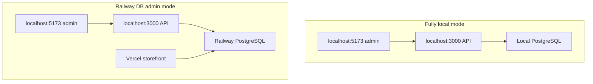
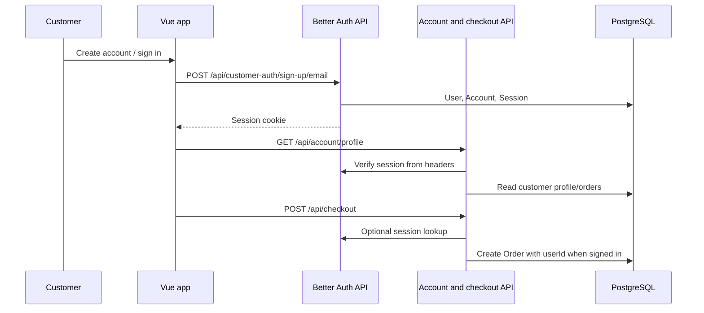

# Auth Roadmap

Last updated: 2026-06-13

## Current Auth Split

The project now has two auth surfaces:

- Customer accounts use Better Auth on `/api/customer-auth`.
- The existing admin dashboard still uses the custom admin auth endpoints on `/api/auth`.

This split is intentional for the Better Auth customer-account infrastructure phase. It preserves the accepted admin dashboard while adding customer accounts, order history, and future loyalty/support/review foundations.

## Customer Better Auth

Customer Better Auth files:

- `server/src/domains/auth/services/customerAuth.service.js`
- `server/src/app/middleware/auth/requireCustomerAuth.js`
- `server/src/domains/account/routes/account.routes.js`
- `client/src/domains/account/api/authClient.js`
- `client/src/domains/account/api/accountAuth.api.js`
- `client/src/domains/account/composables/useAccountAuth.js`
- `client/src/domains/account/views/*`

Implemented behavior:

1. Customer creates account or signs in through Better Auth email/password endpoints.
2. Better Auth stores `User`, `Session`, `Account`, and `Verification` records through the Prisma adapter.
3. Session cookies authenticate protected account routes.
4. `/api/account/*` routes use `requireCustomerAuth`.
5. Logged-in checkout links the created order to `Order.userId` from the server-side session only.
6. Guest checkout remains available and keeps `Order.userId` null.
7. Verified-email matching is prepared for older guest orders when `User.emailVerified` is true.
8. Public sign-up cannot create admin accounts because Better Auth role/status fields have `input: false`.
9. Better Auth sign-up, sign-in, and get-session JSON responses are sanitized by an after hook so `token` fields are not exposed to application code.

## Better Auth Infrastructure

Better Auth Infrastructure is connected through the official `@better-auth/infra` package.

Server setup:

- Package: `@better-auth/infra`
- File: `server/src/domains/auth/services/customerAuth.service.js`
- Plugin: `dash({ apiKey: process.env.BETTER_AUTH_API_KEY })`
- Required Railway/server variable: `BETTER_AUTH_API_KEY`

Client setup:

- Package: `@better-auth/infra`
- File: `client/src/domains/account/api/authClient.js`
- Plugin: `dashClient()`
- No Infrastructure API key is exposed to Vercel/client code.

Notes:

- Sentinel/security challenge plugins are not enabled in this pass.
- Activity tracking schema additions are not enabled in this pass, so no new activity field migration was added.
- The real Infrastructure API key must be created in the Better Auth Infrastructure dashboard and configured only in Railway/server environment variables.

Customer routes:

- `/account/sign-in`
- `/account/create`
- `/account`
- `/account/profile`
- `/account/orders`
- `/account/orders/:reference`
- `/account/forgot-password`
- `/account/reset-password`

## Current Admin Auth

Admin auth remains custom in this phase.

Current admin auth files:

- `server/src/domains/auth/routes/auth.routes.js`
- `server/src/domains/auth/services/auth.service.js`
- `server/src/app/middleware/auth/requireAdminAuth.js`
- `client/src/app/router/index.js`
- `client/src/domains/admin/views/AdminLoginView.vue`

Current admin behavior:

1. Admin submits credentials.
2. Server checks `ADMIN_EMAIL` and `ADMIN_PASSWORD_HASH`.
3. Server sets an HttpOnly admin session cookie.
4. Client admin guard calls `/api/auth/me`.
5. Protected admin routes render if authenticated.

## Current Limitation

When frontend and backend are on unrelated deployed domains, Safari and other browser privacy controls can make cross-site admin cookies unreliable. The temporary workaround is not a bearer-token fallback. The preferred temporary workflow is local client to local server, with the local server choosing local DB or Railway DB.

## Temporary Local Admin Modes

Commands:

- Fully local: `cd server && npm run dev:local`; `cd client && npm run dev:local`
- Railway DB admin: `cd server && npm run dev:railway`; `cd client && npm run dev:local`

## Same-Site Domain Direction

The stable deployed admin path should use an owned domain and API subdomain so cookies are same-site from the browser's perspective.

Example shape, not hardcoded source config:

- Storefront/admin: owned primary domain.
- API: API subdomain under the same site.
- Railway CORS: allow exact frontend origin.
- Client API base URL: deployment dashboard variable.

## Implemented Customer Account Flow

## Future Better Auth Plan

Future Better Auth work should:

- Replace the custom admin session implementation.
- Preserve the existing admin dashboard UI and routes.
- Add role/permission checks such as `ADMIN` and `CUSTOMER`.
- Extend customer accounts with saved addresses, loyalty points, referral rewards, and customer profile pages.
- Avoid starting until checkout, deployed storefront, temporary admin workflow, and admin CRUD are stable.

## Required Environment Names

Document variable names only:

- `ADMIN_EMAIL`
- `ADMIN_PASSWORD_HASH`
- `ADMIN_SESSION_SECRET`
- `BETTER_AUTH_SECRET`
- `BETTER_AUTH_URL`
- `BETTER_AUTH_API_KEY`
- `API_BASE_URL`
- `EMAIL_PROVIDER`
- `CLIENT_URL`
- `FRONTEND_URL`
- `DATABASE_URL`
- `STRIPE_SECRET_KEY`
- `VITE_API_BASE_URL`
- `VITE_API_URL`
- `VITE_STRIPE_PUBLISHABLE_KEY`

Do not document actual values.
