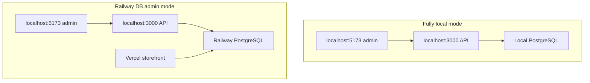
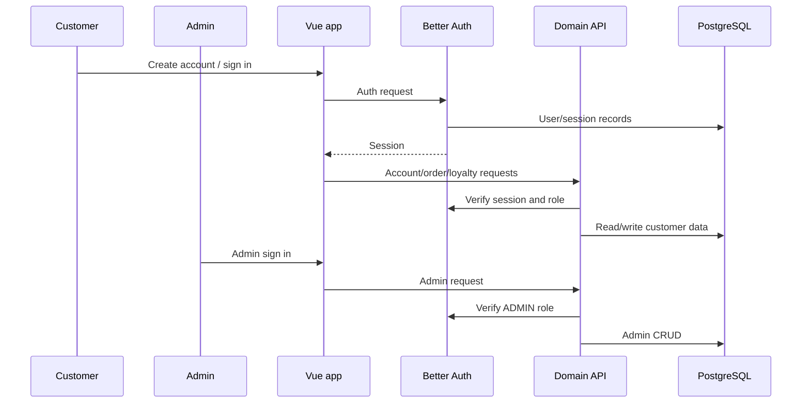

# Auth Roadmap

Last updated: 2026-06-06

## Current Auth

The project currently uses custom admin auth, not Better Auth.

Current files:

- `server/src/domains/auth/routes/auth.routes.js`
- `server/src/domains/auth/services/auth.service.js`
- `server/src/app/middleware/auth/requireAdminAuth.js`
- `client/src/app/router/index.js`
- `client/src/domains/admin/views/AdminLoginView.vue`

Current behavior:

1. Admin submits credentials.
2. Server checks `ADMIN_EMAIL` and `ADMIN_PASSWORD_HASH`.
3. Server sets an HttpOnly admin session cookie.
4. Client admin guard calls `/api/auth/me`.
5. Protected admin routes render if authenticated.

## Current Limitation

When frontend and backend are on unrelated deployed domains, Safari and other browser privacy controls can make cross-site admin cookies unreliable. The temporary workaround is not a bearer-token fallback. The preferred temporary workflow is local client to local server, with the local server choosing local DB or Railway DB.

## Temporary Local Admin Modes

Commands:

- Fully local: `cd server && npm run dev:local`; `cd client && npm run dev:local`
- Railway DB admin: `cd server && npm run dev:railway`; `cd client && npm run dev:local`

## Same-Site Domain Direction

The stable deployed admin path should use an owned domain and API subdomain so cookies are same-site from the browser's perspective.

Example shape, not hardcoded source config:

- Storefront/admin: owned primary domain.
- API: API subdomain under the same site.
- Railway CORS: allow exact frontend origin.
- Client API base URL: deployment dashboard variable.

## Future Better Auth Plan

Future Better Auth work should:

- Replace the custom admin session implementation.
- Preserve the existing admin dashboard UI and routes.
- Add role/permission checks such as `ADMIN` and `CUSTOMER`.
- Support customer accounts, order history, saved addresses, loyalty points, referral rewards, and customer profile pages.
- Avoid starting until checkout, deployed storefront, temporary admin workflow, and admin CRUD are stable.

## Required Environment Names

Document variable names only:

- `ADMIN_EMAIL`
- `ADMIN_PASSWORD_HASH`
- `ADMIN_SESSION_SECRET`
- `CLIENT_URL`
- `FRONTEND_URL`
- `DATABASE_URL`
- `STRIPE_SECRET_KEY`
- `VITE_API_BASE_URL`
- `VITE_API_URL`
- `VITE_STRIPE_PUBLISHABLE_KEY`

Do not document actual values.
