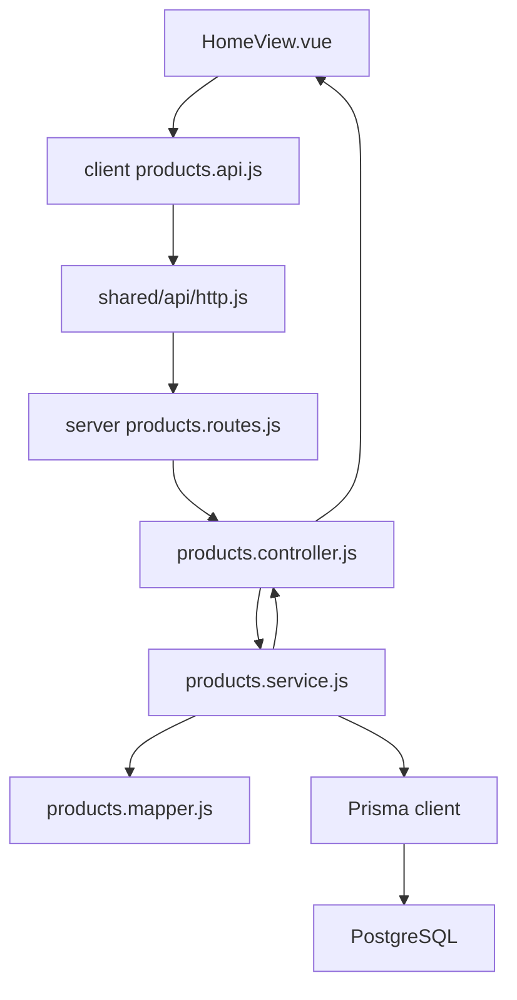
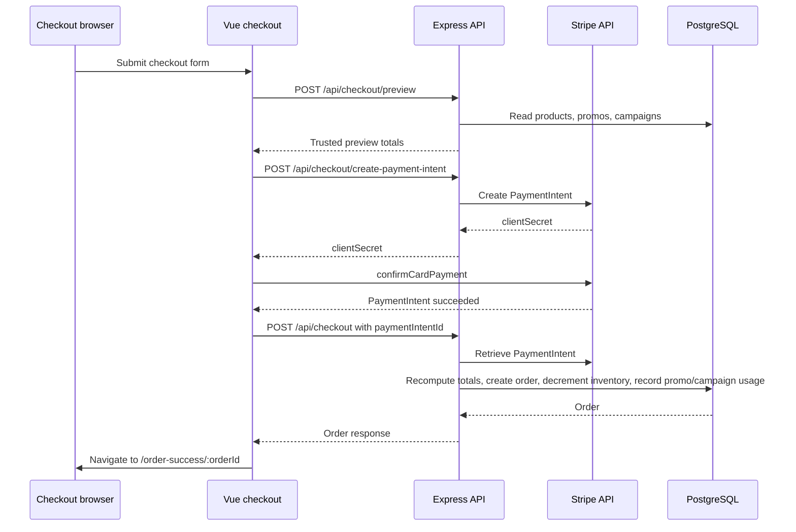
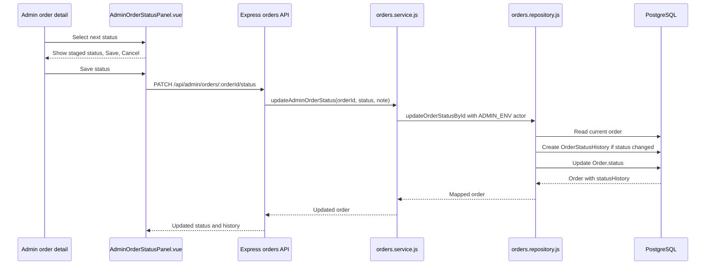
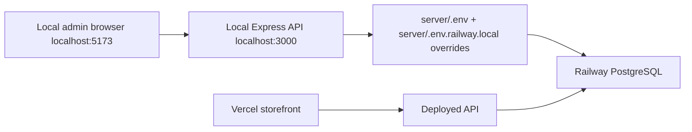
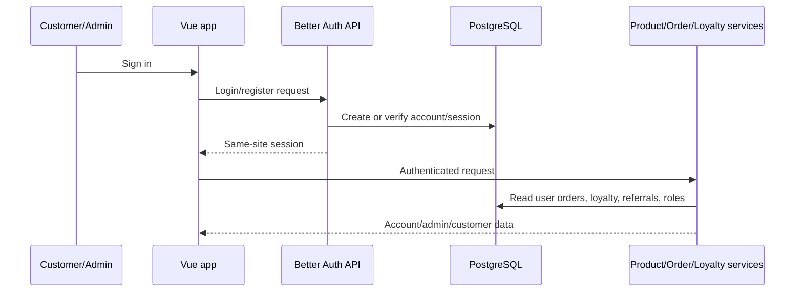

# Data Flow Maps

Last updated: 2026-06-07

## Overall Request Flow

## Storefront Product Load

1. `client/src/domains/storefront/Home/HomeView.vue` calls `useProducts().loadProducts()` on mount.
2. `client/src/domains/products/composables/useProducts.js` calls `client/src/domains/products/api/products.api.js`.
3. `client/src/shared/api/http.js` builds the API URL from `VITE_API_BASE_URL` or `VITE_API_URL`, sends credentials, and rejects non-JSON deployment errors clearly.
4. `server/src/domains/products/routes/products.routes.js` routes to `products.controller.js`.
5. `products.service.js` reads Prisma products and variants.
6. `products.mapper.js` returns storefront-safe product objects with variant prices normalized from cents to display currency.

## Product Card Add To Cart

1. `ProductCardVariantSelector.vue` emits the clicked size.
2. `HomeView.vue` stores the selected size through `useProductVariants().selectCardSize(product, size)`.
3. `ProductCardActions.vue` emits add-to-cart for the product card.
4. `HomeView.vue` calls `addToCart(product, getSelectedCardSize(product))`.
5. `useCart.addToCart(product, selectedSize)` treats the explicit selected size as the cart source of truth, then finds the matching product variant and uses that variant price.
6. Cart drawer components render the selected size, price, quantity, and subtotal from the cart item.
7. Checkout preview later receives cart items with the selected variant size and price, but final checkout totals are recomputed by the server.

## Quick View Add To Cart

1. `ProductQuickView.vue` owns its `selectedSize` and `quantity` refs.
2. Its `selectedVariant` comes from `useProductVariants().getVariantBySize(product, selectedSize)`.
3. `addProductToCart()` emits a shaped payload with `size`, selected variant `price`, `sku`, `quantity`, and available quantity.
4. `HomeView.vue` calls `addToCart($event, $event.size)`.
5. `useCart` resolves the matching variant and opens the cart drawer.

## Featured Product Add To Cart

1. `ProductSpotlightSection.vue` owns `selectedSize`.
2. Size buttons update `selectedSize`.
3. Price and stock label derive from `selectedVariant`.
4. Add to Cart emits a shaped payload with selected size and price.
5. The featured image and title are not navigation click targets; only size controls and Add to Cart are intended controls.

## Checkout And Payment

Key files:

- Client checkout view: `client/src/domains/checkout/views/CheckoutView.vue`
- Client checkout state: `client/src/domains/checkout/composables/useCheckout.js`
- Client preview state: `client/src/domains/checkout/composables/useCheckoutPreview.js`
- Stripe card element: `client/src/domains/payments/components/StripeElementsForm.vue`
- Payment service: `client/src/domains/payments/services/payment.service.js`
- Server preview/create route: `server/src/domains/checkout/routes/checkout.routes.js`
- Server checkout service: `server/src/domains/checkout/services/checkout.service.js`
- Server pricing: `server/src/domains/checkout/utils/checkoutPricing.js`
- Stripe service: `server/src/domains/payments/services/stripe.payment.js`
- Order repository: `server/src/domains/orders/repositories/orders.repository.js`

## Promo Flow

1. Storefront checkout promo inputs call `useCheckoutPromos().applyPromoCode()`.
2. The client requires a customer email before validation, normalizes it with trim and lowercase, and calls `POST /api/promos/validate`.
3. If the customer email changes after a promo is applied, the client clears the applied promo so the new email must be validated.
4. `server/src/domains/promos/services/promos.service.js` normalizes promo codes and customer email, requires a valid email for validation, resolves scheduled/expired status, reads total and per-customer usage counts, validates customer-specific usage, and calculates discounts.
5. Checkout preview and final checkout remain server-owned: `checkout.service.js` recomputes totals and passes the normalized email into promo validation.
6. During order creation, promo usage is recorded through `recordPromoUsage`; the service stores normalized customer email and rechecks per-customer usage limits inside the transaction.
7. Campaign donation preview and promo discounts can coexist because promo discount calculation and campaign donation calculation are separate server-owned checkout pricing steps.
8. Admin promo CRUD calls `/api/admin/promos`, which is the same promo router mounted behind `requireAdminAuth`.
9. Promo list ordering uses real `Promo.updatedAt`. Promo analytics usage history uses `PromoUsage.redeemedAt`.
10. Promo start/end datetime fields are normalized to ISO DateTime strings before Prisma create/update.

## Campaign Flow

1. Campaigns are read from `client/src/domains/campaigns/api/campaigns.api.js`.
2. Server campaign routes are mounted at `/api/campaigns` and `/api/admin/campaigns`.
3. Campaign service/repository code manages active/paused/ended lifecycle, product links, donation calculations, and admin CRUD.
4. Checkout preview includes campaign donation impact when cart items match active campaign product IDs.
5. Order creation records campaign usage server-side with `OrderCampaignUsage` rows tied to the created order.
6. Campaign admin responses include recent attributed orders when attribution rows exist.

## Order Flow

1. Checkout creates an order through `POST /api/checkout` after Stripe succeeds.
2. `checkout.service.js` recomputes trusted totals, verifies Stripe status/amount/currency, prevents duplicate order creation for a reused PaymentIntent, creates order records, decrements inventory, and records promo/campaign usage.
3. Admin order list/detail clients call `client/src/domains/admin/api/adminOrders.api.js`.
4. Server admin orders are mounted at `/api/admin/orders` and guarded by admin auth in the orders route layer.
5. Admin order timeline labels are centralized in `client/src/domains/admin/constants/adminOrders.constants.js`.
6. Admin order detail shows the current status separately from the staged next status selector. Status changes persist only after Save; Cancel resets the staged selection.
7. Status updates create `OrderStatusHistory` rows when the status changes. Until Better Auth/admin users exist, entries use `changedByType: ADMIN_ENV` and `changedBy: ADMIN_ENV`.
8. Admin order responses include `donationAmount`, campaign attribution rows, promo usage when recorded, same-customer order summaries, `lastStatusChange`, and `statusHistory`.

## Order Status History Flow

## Campaign Attribution Flow

1. Checkout preview returns campaign donation preview rows with `campaignId`, `matchedSubtotal`, `donationAmount`, and `matchedProductIds`.
2. After Stripe is verified and the order is created, `checkout.service.js` calls `recordCampaignDonationUsage()` with the created `order.id`.
3. `campaigns.repository.js` creates one `OrderCampaignUsage` row per order/campaign pair and increments aggregate campaign stats in the same transaction.
4. `orders.repository.js` includes `campaignUsages` when reading admin orders and order detail.
5. `orders.mapper.js` exposes `donationAmount` and `campaignAttributions` to admin screens.
6. `campaigns.mapper.js` exposes recent `orderAttributions` in campaign admin responses.
7. Historical orders created before the attribution migration may not have attribution rows.

## Order Success Flow

1. Checkout success clears local cart storage.
2. Checkout redirects to `/order-success/:reference` using the friendly order number when available.
3. `OrderSuccessView.vue` calls `fetchCheckoutOrder(reference)`.
4. `GET /api/checkout/orders/:reference` returns a customer-safe mapped order without internal order id or Stripe PaymentIntent id.
5. The success page shows item summary, pricing, donation, fulfillment expectation, confirmation email copy, and Continue Shopping.
6. The old View Cart action is removed because the cart is cleared after successful checkout.

## Local Admin To Railway DB Flow

The temporary Railway DB admin workflow avoids Safari cross-site admin cookie failures because the browser only talks to the local backend. The local backend chooses the database target at startup.

## Future Better Auth Customer Accounts Flow

Future Better Auth work should replace the custom auth/session layer, add roles such as `ADMIN` and `CUSTOMER`, and preserve the existing admin dashboard routes as the UI surface.
