# Data Flow Maps

Last updated: 2026-10-09

## Overall Request Flow

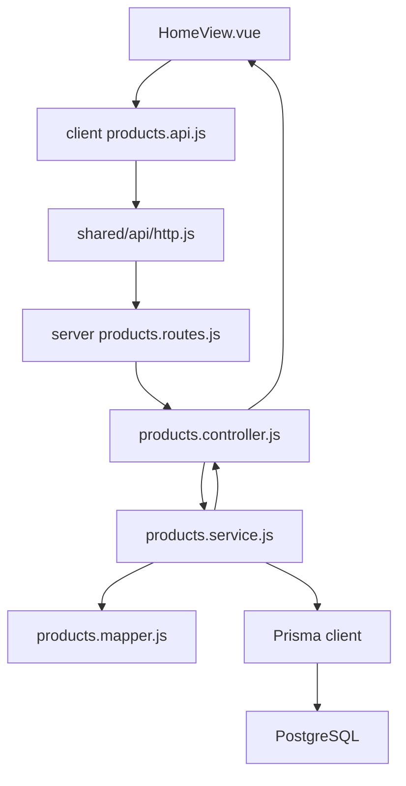
```mermaid
flowchart TB
  Home["HomeView.vue"] --> ProductsApi["client products.api.js"]
  ProductsApi --> Http["shared/api/http.js"]
  Http --> ProductsRoute["server products.routes.js"]
  ProductsRoute --> ProductsController["products.controller.js"]
  ProductsController --> ProductsService["products.service.js"]
  ProductsService --> ProductMapper["products.mapper.js"]
  ProductsService --> Prisma["Prisma client"]
  Prisma --> Postgres["PostgreSQL"]
  ProductsService --> ProductsController
  ProductsController --> Home
```

## Storefront Product Load

1. `client/src/domains/storefront/Home/HomeView.vue` calls `useProducts().loadProducts()` on mount.
2. `client/src/domains/products/composables/useProducts.js` calls `client/src/domains/products/api/products.api.js`.
3. `client/src/shared/api/http.js` builds the API URL from `VITE_API_BASE_URL` or `VITE_API_URL`, sends credentials, and rejects non-JSON deployment errors clearly.
4. `server/src/domains/products/routes/products.routes.js` routes to `products.controller.js`.
5. `products.service.js` reads Prisma products and variants.
6. The server `products.mapper.js` returns product objects; variant prices remain stored/API cents (only the legacy root price is converted there). The client `products/mappers/product.mapper.js` converts variant cents to display currency exactly once and derives the starting price from the first ordered active variant. `products/utils/productVariants.js` orders 6 oz then 18 oz deterministically without mutating API rows. This keeps database return order from changing size selection or price presentation.

## Product Card Add To Cart

1. `ProductCardVariantSelector.vue` emits the clicked size.
2. `HomeView.vue` stores the selected size through `useProductVariants().selectCardSize(product, size)`.
3. `ProductCardActions.vue` emits add-to-cart for the product card.
4. `HomeView.vue` calls `addToCart(product, getSelectedCardSize(product))`.
5. `useCart.addToCart(product, selectedSize)` treats the explicit selected size as the cart source of truth, then finds the matching product variant and uses that variant price.
6. Cart drawer components render the selected size, price, quantity, and subtotal from the cart item.
7. Checkout preview later receives cart items with the selected variant size and price, but final checkout totals are recomputed by the server.

## Quick View Add To Cart

1. `ProductQuickView.vue` owns local `selectedSize` and `quantity` refs, initialized from the card's selected size when valid, otherwise the first ordered active variant.
2. Its `selectedVariant` comes from `useProductVariants().getVariantBySize(product, selectedSize)`.
3. `addProductToCart()` emits a shaped payload with `size`, selected variant `price`, `sku`, `quantity`, and available quantity.
4. `HomeView.vue` calls `addToCart($event, $event.size)`.
5. `useCart` resolves the matching variant and opens the cart drawer.

## Featured Product Add To Cart

1. `HomeView.vue` selects the featured item from the unfiltered active catalog, independent of search/sort.
2. `ProductSpotlightSection.vue` receives the same per-product selected size used by the product card; size buttons emit to the parent `useProductVariants` source of truth.
3. Price and stock label derive from the selected variant, using nullish defaults so zero is not replaced by another size's price.
4. Add to Cart emits the product and explicit selected size; `useCart` resolves the corresponding variant. Cart persistence failures keep in-memory shopping usable.
5. The featured image and title are not navigation click targets; only size controls and Add to Cart are intended controls.

## Checkout And Payment

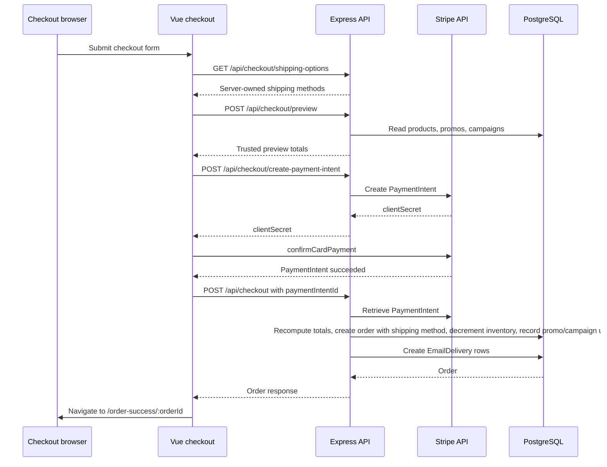
```mermaid
sequenceDiagram
  participant Browser as Checkout browser
  participant Client as Vue checkout
  participant API as Express API
  participant Stripe as Stripe API
  participant DB as PostgreSQL

  Browser->>Client: Submit checkout form
  Client->>API: GET /api/checkout/shipping-options
  API-->>Client: Server-owned shipping methods
  Client->>API: POST /api/checkout/preview
  API->>DB: Read products, promos, campaigns
  API-->>Client: Trusted preview totals
  Client->>API: POST /api/checkout/create-payment-intent
  API->>Stripe: Create PaymentIntent
  Stripe-->>API: clientSecret
  API-->>Client: clientSecret
  Client->>Stripe: confirmCardPayment
  Stripe-->>Client: PaymentIntent succeeded
  Client->>API: POST /api/checkout with paymentIntentId
  API->>Stripe: Retrieve PaymentIntent
  API->>DB: Recompute totals, create order with shipping method, decrement inventory, record promo/campaign usage
  API->>DB: Create EmailDelivery rows
  DB-->>API: Order
  API-->>Client: Order response
  Client->>Browser: Navigate to /order-success/:orderId
```

Key files:

- Client checkout view: `client/src/domains/checkout/views/CheckoutView.vue`
- Client checkout state: `client/src/domains/checkout/composables/useCheckout.js`
- Client preview state: `client/src/domains/checkout/composables/useCheckoutPreview.js`
- Stripe card element: `client/src/domains/payments/components/StripeElementsForm.vue`
- Payment service: `client/src/domains/payments/services/payment.service.js`
- Server preview/create route: `server/src/domains/checkout/routes/checkout.routes.js`
- Server checkout service: `server/src/domains/checkout/services/checkout.service.js`
- Server pricing: `server/src/domains/checkout/utils/checkoutPricing.js`
- Server shipping options: `server/src/domains/checkout/constants/checkout.constants.js`
- Stripe service: `server/src/domains/payments/services/stripe.payment.js`
- Order repository: `server/src/domains/orders/repositories/orders.repository.js`

## Promo Flow

1. Storefront checkout promo inputs call `useCheckoutPromos().applyPromoCode()`.
2. The client requires a customer email before validation, normalizes it with trim and lowercase, and calls `POST /api/promos/validate`.
3. If the customer email changes after a promo is applied, the client clears the applied promo so the new email must be validated.
4. `server/src/domains/promos/services/promos.service.js` normalizes promo codes and customer email, requires a valid email for validation, resolves scheduled/expired status, reads total and per-customer usage counts, validates customer-specific usage, and calculates discounts.
5. Checkout preview and final checkout remain server-owned: `checkout.service.js` recomputes totals and passes the normalized email into promo validation.
6. During order creation, promo usage is recorded through `recordPromoUsage`; the service stores normalized customer email and rechecks per-customer usage limits inside the transaction.
7. Campaign donation preview and promo discounts can coexist because promo discount calculation and campaign donation calculation are separate server-owned checkout pricing steps.
8. Admin promo CRUD calls `/api/admin/promos`, which is the same promo router mounted behind `requireAdminAuth`.
9. Promo list ordering uses real `Promo.updatedAt`. Promo analytics usage history uses `PromoUsage.redeemedAt`.
10. Promo start/end datetime fields are normalized to ISO DateTime strings before Prisma create/update.

## Campaign Flow

1. `publicCampaigns.api.js` calls `GET /api/campaigns/public` for active/scheduled-eligible badge summaries and `GET /api/campaigns/public/:slug` for a public page. Public routes precede the admin `/:campaignId` route. All management routes still require admin auth.
2. The public service filters schedule/status and prioritizes featured campaigns. `publicCampaign.mapper.js` allowlists customer-safe fields; it does not return internal revenue, order count, usage/attribution records, emails, or arbitrary private fields.
3. Active giving is independent of public-page visibility. Legacy campaigns can tint an eligible product and show a plain badge without a page link. Slug page reads require `publicPageEnabled` and Active/Paused/Ended status; Draft/Archived are excluded by the repository. Renames retain the slug.
4. `useStorefrontCampaigns` supplies product-matched badges without blocking catalog loads on error. `useCampaignPage` sequences slug requests so a stale response cannot replace the latest page.
5. `CampaignView.vue` composes the existing header/auth/search/cart/quick view and `CampaignPageContent.vue`. The renderer shows introduction/image, beneficiary, optional story, giving/schedule/generated impact, and active eligible products. Paused/ended pages explain that purchases do not currently contribute. Generated impact is not proof of payout.
6. `AdminCampaignForm.vue` uses the same renderer with section edit handles and inert product actions. `AdminCampaignSectionFields.vue` updates a draft; mappers create the canvas model and ISO request payload; validators check before an explicit Save. Server validation applies on both create and update. No automatic persistence or separate preview implementation exists.
7. Checkout still uses the existing campaign API/service. Eligible fixed contributions apply once per order; percentage contributions use eligible subtotal before promo discounts. Giving is business-funded, not an added customer charge, and can coexist with promos. These financial calculations were not changed by the UI phase.
8. Verified order creation records campaign usage server-side with `OrderCampaignUsage` rows and its existing order/campaign uniqueness. Admin responses continue to include protected recent attributed orders. The new public content fields do not alter attribution or inventory logic.

## Order Flow

1. Checkout creates an order through `POST /api/checkout` after Stripe succeeds.
2. `checkout.service.js` recomputes trusted totals, verifies Stripe status/amount/currency, prevents duplicate order creation for a reused PaymentIntent, creates order records, decrements inventory, and records promo/campaign usage.
3. If a valid Better Auth customer session cookie is present, checkout links the order with `Order.userId`. Guest checkout remains available with `Order.userId = null`.
4. Admin order list/detail clients call `client/src/domains/admin/api/adminOrders.api.js`.
5. Server admin orders are mounted at `/api/admin/orders` and guarded by admin auth in the orders route layer.
6. Admin order timeline labels are centralized in `client/src/domains/admin/constants/adminOrders.constants.js`.
7. Admin order detail shows the current status separately from the staged next status selector. Status changes persist only after Save; Cancel resets the staged selection.
8. Status updates create `OrderStatusHistory` rows when the status changes. Until Better Auth/admin users replace the custom admin auth system, entries use `changedByType: ADMIN_ENV` and `changedBy: ADMIN_ENV`.
9. Admin order responses include `donationAmount`, campaign attribution rows, promo usage when recorded, same-customer order summaries, `lastStatusChange`, and `statusHistory`.

## Customer Account Flow

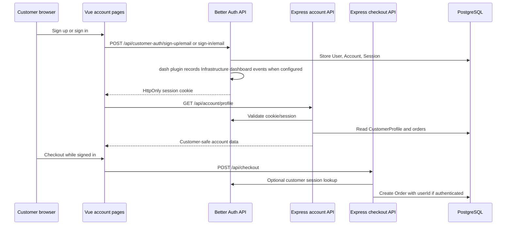
```mermaid
sequenceDiagram
  participant Customer as Customer browser
  participant Client as Vue account pages
  participant Auth as Better Auth API
  participant AccountAPI as Express account API
  participant CheckoutAPI as Express checkout API
  participant DB as PostgreSQL

  Customer->>Client: Sign up or sign in
  Client->>Auth: POST /api/customer-auth/sign-up/email or sign-in/email
  Auth->>DB: Store User, Account, Session
  Auth->>Auth: dash plugin records Infrastructure dashboard events when configured
  Auth-->>Client: HttpOnly session cookie
  Client->>AccountAPI: GET /api/account/profile
  AccountAPI->>Auth: Validate cookie/session
  AccountAPI->>DB: Read CustomerProfile and orders
  AccountAPI-->>Client: Customer-safe account data
  Customer->>Client: Checkout while signed in
  Client->>CheckoutAPI: POST /api/checkout
  CheckoutAPI->>Auth: Optional customer session lookup
  CheckoutAPI->>DB: Create Order with userId if authenticated
```

Customer account routes:

- `/account/sign-in`
- `/account/create`
- `/account`
- `/account/profile`
- `/account/orders`
- `/account/orders/:reference`
- `/account/forgot-password`
- `/account/reset-password`

Important constraints:

- Guest checkout remains valid.
- The client never submits `userId` for checkout.
- Server-side checkout owns order linking by reading the Better Auth session.
- Verified-email guest matching is restricted to users with `emailVerified = true`.

## Admin Customer Management Flow

1. Admin visits `/admin/customers` or `/admin/customers/:id`.
2. The existing admin router guard validates `/api/auth/me`.
3. Admin customer API calls use `/api/admin/customers`, protected by `requireAdminAuth`.
4. Server customer services read `User`, linked `Order` rows, verified-email guest matches, account events, support placeholders, review placeholders, notification preferences, and loyalty placeholders.
5. Deactivate/reactivate actions update `User.status` and create `CustomerAccountEvent` rows with `changedByType: ADMIN_ENV`.
6. Resend verification and password reset actions call Better Auth email APIs, which queue Resend-backed `EmailDelivery` records when provider env is configured.
7. Admin customer detail shows recent notification delivery history from `EmailDelivery`.
8. Admin dashboard reads order stats, customer summaries, and notification stats to show orders, customers, revenue, shipment activity, tracking summary, and notification activity.

## Notification Flow

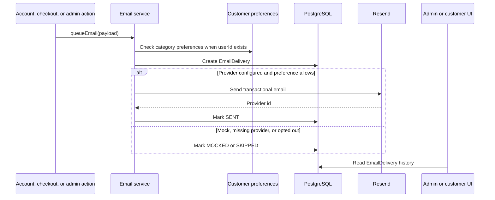
```mermaid
sequenceDiagram
  participant Trigger as Account, checkout, or admin action
  participant Email as Email service
  participant Prefs as Customer preferences
  participant DB as PostgreSQL
  participant Resend
  participant UI as Admin or customer UI

  Trigger->>Email: queueEmail(payload)
  Email->>Prefs: Check category preferences when userId exists
  Email->>DB: Create EmailDelivery
  alt Provider configured and preference allows
    Email->>Resend: Send transactional email
    Resend-->>Email: Provider id
    Email->>DB: Mark SENT
  else Mock, missing provider, or opted out
    Email->>DB: Mark MOCKED or SKIPPED
  end
  UI->>DB: Read EmailDelivery history
```

Notification surfaces:

- Customer profile reads `/api/account/notifications`.
- Admin dashboard reads `/api/admin/notifications`.
- Admin order detail reads order-scoped `emailDeliveries` from `/api/admin/orders/:orderId`.
- Admin customer detail reads customer-scoped `emailDeliveries` from `/api/admin/customers/:customerId`.

## Tracking Flow

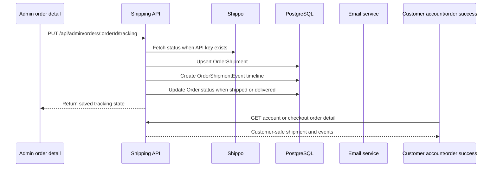
```mermaid
sequenceDiagram
  participant Admin as Admin order detail
  participant API as Shipping API
  participant Shippo
  participant DB as PostgreSQL
  participant Email as Email service
  participant Customer as Customer account/order success

  Admin->>API: PUT /api/admin/orders/:orderId/tracking
  API->>Shippo: Fetch status when API key exists
  API->>DB: Upsert OrderShipment
  API->>DB: Create OrderShipmentEvent timeline
  API->>DB: Update Order.status when shipped or delivered
  API-->>Admin: Return saved tracking state
  Customer->>API: GET account or checkout order detail
  API-->>Customer: Customer-safe shipment and events
```

Communications policy note: tracking/order changes should be saved separately from customer email sends. Future tracking work should require an explicit admin send action for tracking, shipped, delivered, review, support, issue-resolution, apology, promo, and marketing emails.

## Checkout Shipping Rate Flow

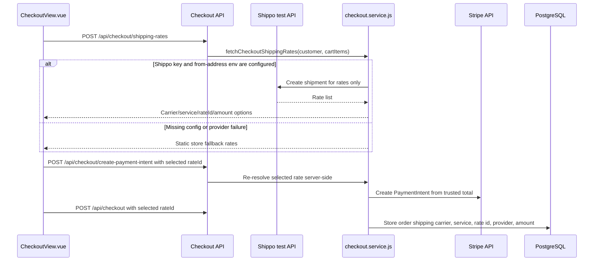
```mermaid
sequenceDiagram
  participant Client as CheckoutView.vue
  participant CheckoutAPI as Checkout API
  participant Shippo as Shippo test API
  participant CheckoutService as checkout.service.js
  participant Stripe as Stripe API
  participant DB as PostgreSQL

  Client->>CheckoutAPI: POST /api/checkout/shipping-rates
  CheckoutAPI->>CheckoutService: fetchCheckoutShippingRates(customer, cartItems)
  alt Shippo key and from-address env are configured
    CheckoutService->>Shippo: Create shipment for rates only
    Shippo-->>CheckoutService: Rate list
    CheckoutService-->>Client: Carrier/service/rateId/amount options
  else Missing config or provider failure
    CheckoutService-->>Client: Static store fallback rates
  end
  Client->>CheckoutAPI: POST /api/checkout/create-payment-intent with selected rateId
  CheckoutAPI->>CheckoutService: Re-resolve selected rate server-side
  CheckoutService->>Stripe: Create PaymentIntent from trusted total
  Client->>CheckoutAPI: POST /api/checkout with selected rateId
  CheckoutService->>DB: Store order shipping carrier, service, rate id, provider, amount
```

Shippo rate shopping is intentionally rate-only. The app does not buy labels from checkout and falls back to store rates when Shippo configuration or address data is incomplete.

## Order Status History Flow

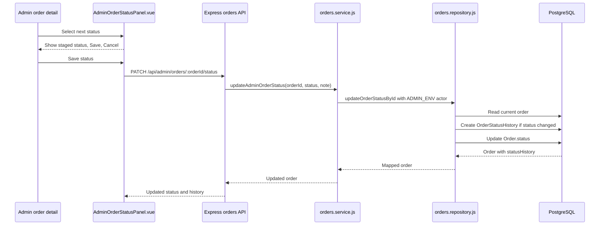
```mermaid
sequenceDiagram
  participant Admin as Admin order detail
  participant Client as AdminOrderStatusPanel.vue
  participant API as Express orders API
  participant Service as orders.service.js
  participant Repo as orders.repository.js
  participant DB as PostgreSQL

  Admin->>Client: Select next status
  Client-->>Admin: Show staged status, Save, Cancel
  Admin->>Client: Save status
  Client->>API: PATCH /api/admin/orders/:orderId/status
  API->>Service: updateAdminOrderStatus(orderId, status, note)
  Service->>Repo: updateOrderStatusById with ADMIN_ENV actor
  Repo->>DB: Read current order
  Repo->>DB: Create OrderStatusHistory if status changed
  Repo->>DB: Update Order.status
  DB-->>Repo: Order with statusHistory
  Repo-->>Service: Mapped order
  Service-->>API: Updated order
  API-->>Client: Updated status and history
```

## Customer Order Issue Flow

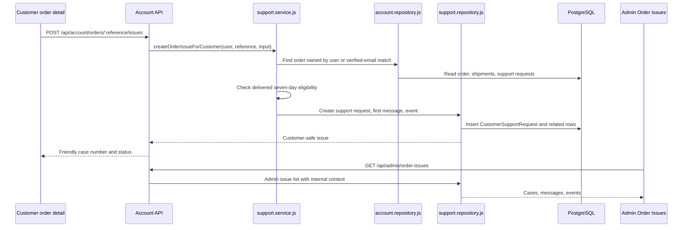
```mermaid
sequenceDiagram
  participant Customer as Customer order detail
  participant AccountApi as Account API
  participant SupportService as support.service.js
  participant AccountRepo as account.repository.js
  participant SupportRepo as support.repository.js
  participant DB as PostgreSQL
  participant Admin as Admin Order Issues

  Customer->>AccountApi: POST /api/account/orders/:reference/issues
  AccountApi->>SupportService: createOrderIssueForCustomer(user, reference, input)
  SupportService->>AccountRepo: Find order owned by user or verified-email match
  AccountRepo->>DB: Read order, shipments, support requests
  SupportService->>SupportService: Check delivered seven-day eligibility
  SupportService->>SupportRepo: Create support request, first message, event
  SupportRepo->>DB: Insert CustomerSupportRequest and related rows
  SupportRepo-->>AccountApi: Customer-safe issue
  AccountApi-->>Customer: Friendly case number and status
  Admin->>AccountApi: GET /api/admin/order-issues
  AccountApi->>SupportRepo: Admin issue list with internal context
  SupportRepo-->>Admin: Cases, messages, events
```

Support replies and status changes are account-first. Saving a support message or status does not automatically send email; email requires a separate future admin template/send action.

## Internal Issue Capture Flow

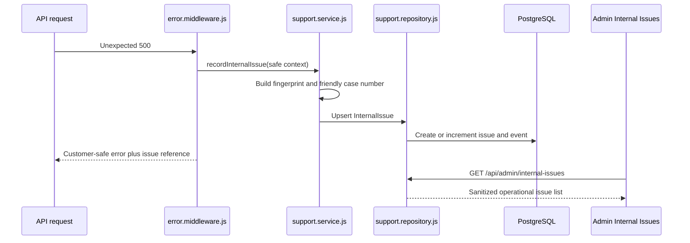
```mermaid
sequenceDiagram
  participant Request as API request
  participant ErrorMiddleware as error.middleware.js
  participant SupportService as support.service.js
  participant SupportRepo as support.repository.js
  participant DB as PostgreSQL
  participant Admin as Admin Internal Issues

  Request->>ErrorMiddleware: Unexpected 500
  ErrorMiddleware->>SupportService: recordInternalIssue(safe context)
  SupportService->>SupportService: Build fingerprint and friendly case number
  SupportService->>SupportRepo: Upsert InternalIssue
  SupportRepo->>DB: Create or increment issue and event
  ErrorMiddleware-->>Request: Customer-safe error plus issue reference
  Admin->>SupportRepo: GET /api/admin/internal-issues
  SupportRepo-->>Admin: Sanitized operational issue list
```

Internal issue records must not store request bodies, cookies, auth/session tokens, provider secrets, database URLs, reset tokens, verification tokens, or raw sensitive provider payloads.

## Campaign Attribution Flow

1. Checkout preview returns campaign donation preview rows with `campaignId`, `matchedSubtotal`, `donationAmount`, and `matchedProductIds`.
2. After Stripe is verified and the order is created, `checkout.service.js` calls `recordCampaignDonationUsage()` with the created `order.id`.
3. `campaigns.repository.js` creates one `OrderCampaignUsage` row per order/campaign pair and increments aggregate campaign stats in the same transaction.
4. `orders.repository.js` includes `campaignUsages` when reading admin orders and order detail.
5. `orders.mapper.js` exposes `donationAmount` and `campaignAttributions` to admin screens.
6. `campaigns.mapper.js` exposes recent `orderAttributions` in campaign admin responses.
7. Historical orders created before the attribution migration may not have attribution rows.

## Order Success Flow

1. Checkout success clears local cart storage.
2. Checkout redirects to `/order-success/:reference` using the friendly order number when available.
3. `OrderSuccessView.vue` calls `fetchCheckoutOrder(reference)`.
4. `GET /api/checkout/orders/:reference` returns a customer-safe mapped order without internal order id or Stripe PaymentIntent id.
5. The success page shows item summary, pricing, donation, fulfillment expectation, confirmation email copy, and Continue Shopping.
6. The old View Cart action is removed because the cart is cleared after successful checkout.

## Local Admin To Railway DB Flow

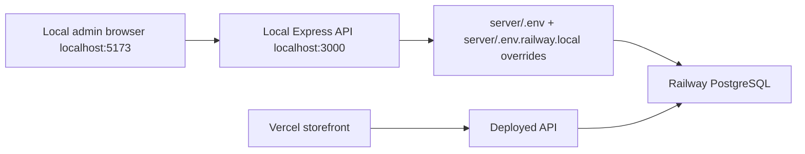
```mermaid
flowchart LR
  AdminBrowser["Local admin browser localhost:5173"] --> LocalApi["Local Express API localhost:3000"]
  LocalApi --> Env["server/.env + server/.env.railway.local overrides"]
  Env --> RailwayDB["Railway PostgreSQL"]
  Vercel["Vercel storefront"] --> DeployedApi["Deployed API"]
  DeployedApi --> RailwayDB
```

The temporary Railway DB admin workflow avoids Safari cross-site admin cookie failures because the browser only talks to the local backend. The local backend chooses the database target at startup.

## Future Better Auth Customer Accounts Flow

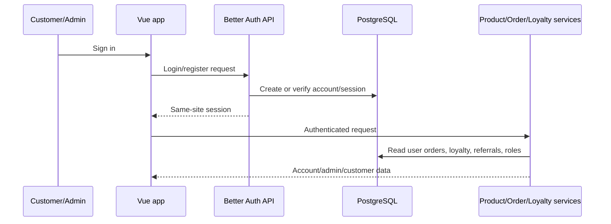
```mermaid
sequenceDiagram
  participant User as Customer/Admin
  participant Client as Vue app
  participant Auth as Better Auth API
  participant DB as PostgreSQL
  participant Domain as Product/Order/Loyalty services

  User->>Client: Sign in
  Client->>Auth: Login/register request
  Auth->>DB: Create or verify account/session
  Auth-->>Client: Same-site session
  Client->>Domain: Authenticated request
  Domain->>DB: Read user orders, loyalty, referrals, roles
  Domain-->>Client: Account/admin/customer data
```

Better Auth customer accounts are already implemented. A future, explicitly approved admin-auth migration may replace custom admin sessions while preserving the dashboard. Loyalty, referrals, and expanded permissions remain future work.

## Public Brand Story And Homepage Presentation

The public `/meet-chase-evie` route lazily loads `BrandView.vue`. Router, desktop/mobile header, home teaser/hero, and footer consume `BRAND_STORY_PATH`; no duplicate URL literal is needed in UI components. `brandContent.js` supplies existing narrative, names, values, and explicitly illustrative photographs to both teaser and story page.

The page reads the catalog through `useProducts()` for the existing variant/inventory-aware cart helpers. It hydrates the same browser cart storage as home/account/campaign views, uses the shared search composable and customer auth header, and has no brand-specific backend API. Cart display is not authoritative checkout pricing; navigating onward uses the existing server-owned checkout preview.

Home passes its actual featured product into HeroSection and ProductSpotlightSection. Hero introduction/tags/shop link therefore follow the featured product, not a hardcoded protein. NextDropsSection consumes the existing coming-soon list/loading/error props and emits Preview/Retry to Home; it does not fetch products or save subscriptions itself. ComingSoonCard reuses ProductCardInfo rather than duplicating category/tag/description/protein rendering. Notify Me remains disabled, with no provider write.

The approved baseline adds bundled illustrative JPEGs via `brandContent.js` for the hero/story teaser/gallery only. It does not replace admin-managed catalog images with sample assets or copy the preview's mock cart/prices into Vue. `home.css` controls homepage bands/short-screen spacing; shared storefront styles add individual-card depth without changing campaign matching.

The existing `useCart.addToCart(product, selectedSize)` opens CartDrawer in place. `useCartDrawerDialog.js` owns only dialog focus/keyboard/scroll lifecycle, including recovery when a removed item destroys its focused button. It has no API, storage, quantity, price, or payment responsibility. CartItemCard emits existing quantity/removal events; CartSummary displays the existing subtotal and sends the customer to `/checkout` only on the explicit checkout link. Closing/restoring focus or navigating away releases scroll locking. Auth/customer ownership and server-owned checkout calculations are unchanged.

Footer reads optional public social variables through a platform/HTTPS validator. The user-approved Instagram destination is the default; TikTok/YouTube remain disabled unless valid profile destinations are supplied. None of these edits change Stripe, promo/campaign attribution, order creation, auth guards, DB target selection, or database schema.

## Calm Essentials Account UI Flow

The protected `/account` parent route mounts `AccountLayout.vue` once. Children render inside the shared storefront-aware `AccountShell.vue`. Public sign-in/create/reset pages use the shell without the sidebar.

| Screen | Data / Action | Source Of Truth |
| --- | --- | --- |
| Overview | GET /api/account | Account summary mapper; maximum two recent orders |
| Orders | GET /api/account/orders, GET /api/account/orders/:reference | Server ownership queries and order snapshots; local eight-row display window |
| Profile / Addresses | GET and PUT /api/account/profile | Profile/preferences; full payload mapper preserves unedited fields |
| Order help | GET /api/account/issues, GET /api/account/issues/:caseNumber | Customer-scoped support queries and customer-visible message mapping |
| Eligible help dialog | POST /api/account/orders/:reference/issues | Server category, delivery-window, ownership, and rate-limit checks |
| Rewards / Wishlist | No feature writes | Explicit future-phase UI, no mock customer data |

KeepAlive retains only the Orders child between account tabs. Sequenced detail requests prevent a slow earlier response from replacing the latest selection. Refresh reloads the list and selected detail. Sign-out exits the layout and clears cached account content. Address edits do not change existing orders. This UI pass adds no backend endpoints, schema changes, provider sends, or environment variables.
