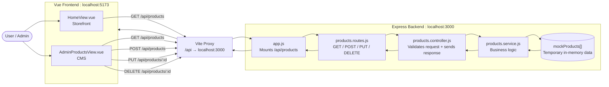

# Doggy Ent Architecture

```mermaid
flowchart LR
  User([User / Admin])

  subgraph Frontend["Vue Frontend : localhost:5173"]
    Home["HomeView.vue\nStorefront"]
    Admin["AdminProductsView.vue\nCMS"]
  end

  Proxy["Vite Proxy\n/api → localhost:3000"]

  subgraph Backend["Express Backend : localhost:3000"]
    App["app.js\nMounts /api/products"]
    Routes["products.routes.js\nGET / POST / PUT / DELETE"]
    Controller["products.controller.js\nValidates request + sends response"]
    Service["products.service.js\nBusiness logic"]
    Data[("mockProducts[]\nTemporary in-memory data")]
  end

  User --> Home
  User --> Admin

  Home -->|"GET /api/products"| Proxy
  Admin -->|"GET /api/products"| Proxy
  Admin -->|"POST /api/products"| Proxy
  Admin -->|"PUT /api/products/:id"| Proxy
  Admin -->|"DELETE /api/products/:id"| Proxy

  Proxy --> App
  App --> Routes
  Routes --> Controller
  Controller --> Service
  Service --> Data
  Data --> Service
  Service --> Controller
  Controller --> Routes
  Routes --> App
  App --> Proxy
  Proxy --> Frontend
```