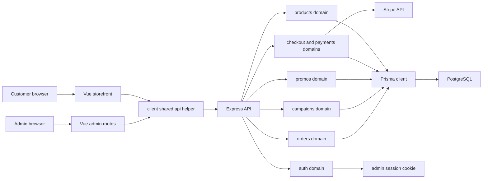

# Doggy Ent Current Architecture Diagram

Last updated: 2026-06-07

This compact diagram reflects the current Prisma-backed application. The older version of this file referred to temporary in-memory product data, which no longer matches the codebase.

