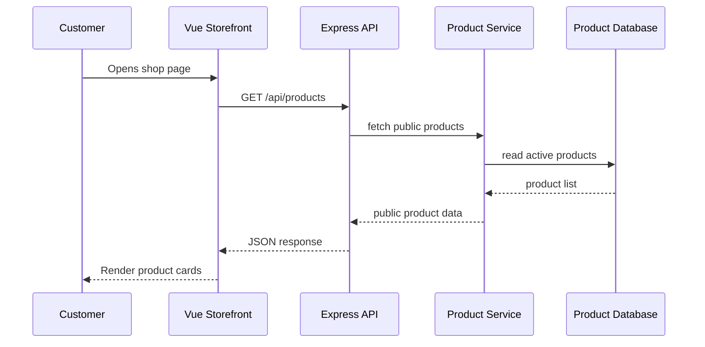
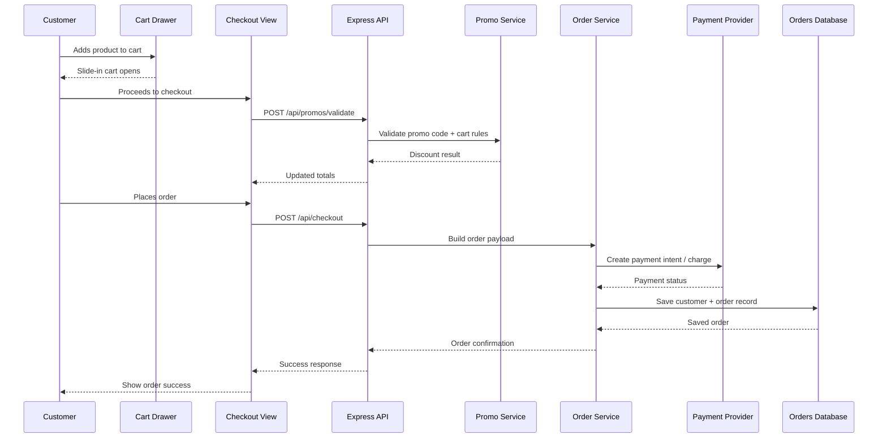
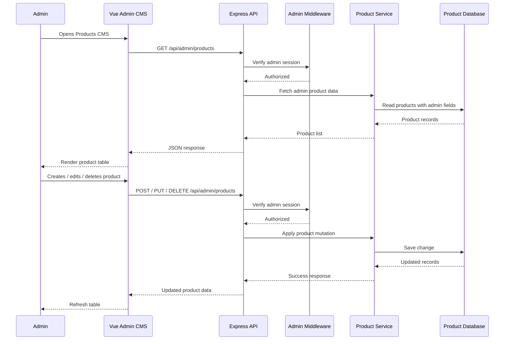

# Doggy Ent Official Mock Architecture

This mock architecture shows how the project should eventually work once the current Vue + Express foundation grows into the full Chase & Evie Co. storefront, cart, checkout, admin CMS, and future database/payment flow.

```mermaid
flowchart LR
  Customer([Customer])
  AdminUser([Admin User])

  subgraph VueApp["Vue Frontend : localhost:5173"]
    Storefront["Storefront Views\nHome, Shop, Product Sections"]
    CartDrawer["Cart Drawer\nAdd, update quantity, remove items"]
    CheckoutView["Checkout View\nContact, shipping, delivery, payment, promo"]
    AdminCMS["Admin CMS Views\nProducts, Orders, Promos"]
    FrontendServices["Frontend API Services\nproducts.api.js, cart.api.js, checkout.api.js"]
  end

  subgraph ViteLayer["Development Proxy Layer"]
    ViteProxy["Vite Proxy\n/api → localhost:3000"]
  end

  subgraph ExpressApp["Express Backend : localhost:3000"]
    App["app.js\nMounts API route groups"]

    PublicRoutes["Public Routes\nGET /api/products\nPOST /api/checkout\nPOST /api/promos/validate"]
    AdminRoutes["Admin Routes\nPOST /api/admin/products\nPUT /api/admin/products/:id\nDELETE /api/admin/products/:id\nGET /api/admin/orders"]
    AuthMiddleware["Auth / Admin Middleware\nProtect admin-only actions"]

    ProductController["Product Controller\nValidate product requests"]
    CartCheckoutController["Checkout Controller\nValidate customer, shipping, cart, promo"]
    AdminController["Admin Controller\nCreate, edit, delete, review"]

    ProductService["Product Service\nCatalog logic"]
    PromoService["Promo Service\nPromo validation + discount rules"]
    OrderService["Order Service\nOrder creation + totals"]
    PaymentService["Payment Service\nStripe / PayPal / wallet provider"]
  end

  subgraph Storage["Future Persistent Storage"]
    ProductDB[("Products Table / Collection")]
    CustomerDB[("Customers Table / Collection")]
    OrderDB[("Orders Table / Collection")]
    PromoDB[("Promos Table / Collection")]
  end

  subgraph External["External Services"]
    PaymentProvider["Payment Provider\nStripe / PayPal / Apple Pay / Google Pay"]
    EmailService["Email Service\nOrder confirmation + shipping updates"]
  end

  Customer --> Storefront
  Storefront --> CartDrawer
  CartDrawer --> CheckoutView
  CheckoutView --> FrontendServices

  AdminUser --> AdminCMS
  AdminCMS --> FrontendServices

  FrontendServices --> ViteProxy
  ViteProxy --> App

  App --> PublicRoutes
  App --> AdminRoutes

  AdminRoutes --> AuthMiddleware
  AuthMiddleware --> AdminController

  PublicRoutes --> ProductController
  PublicRoutes --> CartCheckoutController

  ProductController --> ProductService
  CartCheckoutController --> ProductService
  CartCheckoutController --> PromoService
  CartCheckoutController --> OrderService
  CartCheckoutController --> PaymentService
  AdminController --> ProductService
  AdminController --> PromoService
  AdminController --> OrderService

  ProductService --> ProductDB
  PromoService --> PromoDB
  OrderService --> OrderDB
  OrderService --> CustomerDB

  PaymentService --> PaymentProvider
  PaymentProvider --> PaymentService
  PaymentService --> OrderService

  OrderService --> EmailService
  EmailService --> Customer

  ProductDB --> ProductService
  PromoDB --> PromoService
  OrderDB --> OrderService
  CustomerDB --> OrderService

  ProductService --> ProductController
  ProductService --> AdminController
  PromoService --> CartCheckoutController
  OrderService --> CartCheckoutController

  ProductController --> PublicRoutes
  CartCheckoutController --> PublicRoutes
  AdminController --> AdminRoutes

  PublicRoutes --> App
  AdminRoutes --> App
  App --> ViteProxy
  ViteProxy --> FrontendServices

  FrontendServices --> Storefront
  FrontendServices --> CartDrawer
  FrontendServices --> CheckoutView
  FrontendServices --> AdminCMS
```

## How this should behave officially

### Storefront browsing

### Cart and checkout

### Admin CMS product management

