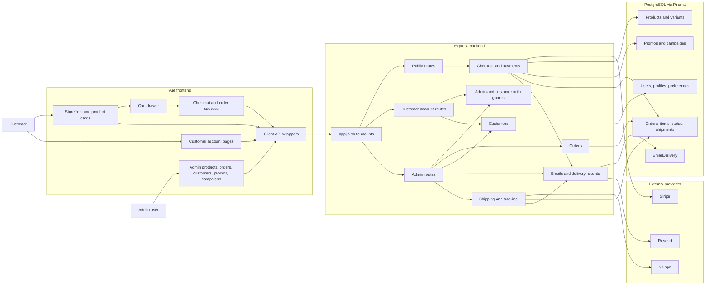
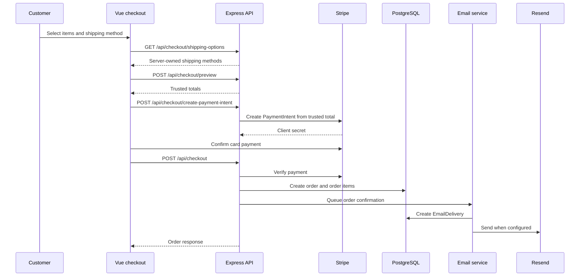
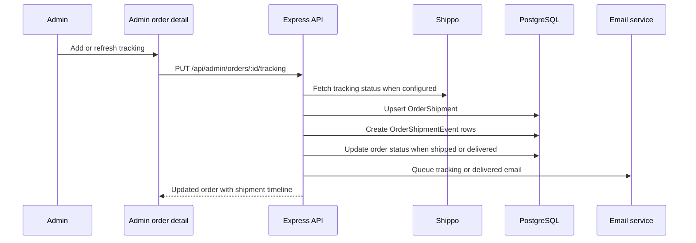
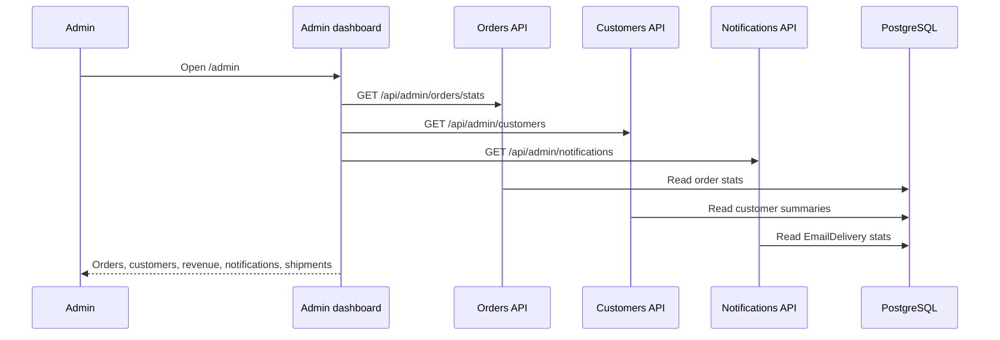

# Doggy Ent Mock Architecture

This diagram documents the intended current shape of the Chase & Evie Co. commerce app: storefront, checkout, admin CMS, customer accounts, notification delivery, and tracking fulfillment.

```mermaid
flowchart LR
  Customer["Customer"]
  AdminUser["Admin user"]

  subgraph VueApp["Vue frontend"]
    Storefront["Storefront and product cards"]
    CartDrawer["Cart drawer"]
    CheckoutView["Checkout and order success"]
    AccountViews["Customer account pages"]
    AdminCMS["Admin products, orders, customers, promos, campaigns"]
    FrontendApis["Client API wrappers"]
  end

  subgraph ExpressApp["Express backend"]
    App["app.js route mounts"]
    PublicRoutes["Public routes"]
    CustomerRoutes["Customer account routes"]
    AdminRoutes["Admin routes"]
    AuthGuards["Admin and customer auth guards"]
    CheckoutDomain["Checkout and payments"]
    OrdersDomain["Orders"]
    CustomersDomain["Customers"]
    EmailDomain["Emails and delivery records"]
    ShippingDomain["Shipping and tracking"]
  end

  subgraph Storage["PostgreSQL via Prisma"]
    ProductDB["Products and variants"]
    OrderDB["Orders, items, status, shipments"]
    CustomerDB["Users, profiles, preferences"]
    EmailDB["EmailDelivery"]
    PromoDB["Promos and campaigns"]
  end

  subgraph Providers["External providers"]
    Stripe["Stripe"]
    Resend["Resend"]
    Shippo["Shippo"]
  end

  Customer --> Storefront
  Storefront --> CartDrawer
  CartDrawer --> CheckoutView
  Customer --> AccountViews
  AdminUser --> AdminCMS

  Storefront --> FrontendApis
  CheckoutView --> FrontendApis
  AccountViews --> FrontendApis
  AdminCMS --> FrontendApis

  FrontendApis --> App
  App --> PublicRoutes
  App --> CustomerRoutes
  App --> AdminRoutes
  CustomerRoutes --> AuthGuards
  AdminRoutes --> AuthGuards

  PublicRoutes --> CheckoutDomain
  CustomerRoutes --> CustomersDomain
  AdminRoutes --> OrdersDomain
  AdminRoutes --> CustomersDomain
  AdminRoutes --> EmailDomain
  AdminRoutes --> ShippingDomain

  CheckoutDomain --> Stripe
  CheckoutDomain --> ProductDB
  CheckoutDomain --> PromoDB
  CheckoutDomain --> OrderDB
  CheckoutDomain --> EmailDomain
  OrdersDomain --> OrderDB
  CustomersDomain --> CustomerDB
  EmailDomain --> EmailDB
  EmailDomain --> Resend
  ShippingDomain --> Shippo
  ShippingDomain --> OrderDB
  ShippingDomain --> EmailDomain
```

## Checkout And Notification Sequence

```mermaid
sequenceDiagram
  participant Customer
  participant Checkout as Vue checkout
  participant API as Express API
  participant Stripe
  participant DB as PostgreSQL
  participant Email as Email service
  participant Resend

  Customer->>Checkout: Select items and shipping method
  Checkout->>API: GET /api/checkout/shipping-options
  API-->>Checkout: Server-owned shipping methods
  Checkout->>API: POST /api/checkout/preview
  API-->>Checkout: Trusted totals
  Checkout->>API: POST /api/checkout/create-payment-intent
  API->>Stripe: Create PaymentIntent from trusted total
  Stripe-->>API: Client secret
  Checkout->>Stripe: Confirm card payment
  Checkout->>API: POST /api/checkout
  API->>Stripe: Verify payment
  API->>DB: Create order and order items
  API->>Email: Queue order confirmation
  Email->>DB: Create EmailDelivery
  Email->>Resend: Send when configured
  API-->>Checkout: Order response
```

## Admin Tracking Sequence

```mermaid
sequenceDiagram
  participant Admin
  participant UI as Admin order detail
  participant API as Express API
  participant Shippo
  participant DB as PostgreSQL
  participant Email as Email service

  Admin->>UI: Add or refresh tracking
  UI->>API: PUT /api/admin/orders/:id/tracking
  API->>Shippo: Fetch tracking status when configured
  API->>DB: Upsert OrderShipment
  API->>DB: Create OrderShipmentEvent rows
  API->>DB: Update order status when shipped or delivered
  API->>Email: Queue tracking or delivered email
  API-->>UI: Updated order with shipment timeline
```

## Admin Dashboard Sequence

```mermaid
sequenceDiagram
  participant Admin
  participant Dashboard as Admin dashboard
  participant OrdersAPI as Orders API
  participant CustomersAPI as Customers API
  participant NotificationsAPI as Notifications API
  participant DB as PostgreSQL

  Admin->>Dashboard: Open /admin
  Dashboard->>OrdersAPI: GET /api/admin/orders/stats
  Dashboard->>CustomersAPI: GET /api/admin/customers
  Dashboard->>NotificationsAPI: GET /api/admin/notifications
  OrdersAPI->>DB: Read order stats
  CustomersAPI->>DB: Read customer summaries
  NotificationsAPI->>DB: Read EmailDelivery stats
  Dashboard-->>Admin: Orders, customers, revenue, notifications, shipments
```
